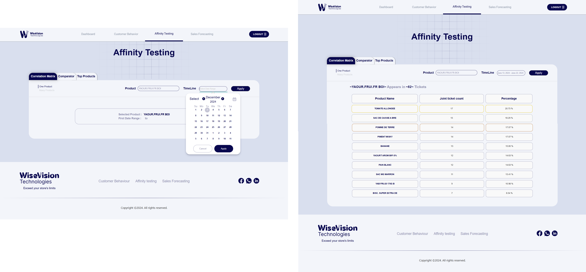

# RetailVision

Welcome to **My GitHub**! This repository contains the updated version of my end-of-studies project—a system designed to help retail businesses analyze sales trends and customer behavior. This project includes a website, authentication system, dashboard, and two primary analytical components that provide actionable insights to improve store management. Below, you'll find a detailed guide to the system's features and instructions for setup.

This is the **link** to version 0 of this project: [End-of-study-project](https://github.com/Sheedii/End-of-study-project).

---

## Features

### 1. Website for WiseVision Startup

A user-friendly website serves as the foundation for WiseVision's online presence. Key sections include:
- **Home**
- **About**
- **Services**
- **Login Page**

  


---

### 2. Dashboard

The dashboard provides an overview of insights from the application's main components:


---

### 3. Affinity Testing System

The Affinity Testing module analyzes:
- **Product correlations:** This component calculates the correlation between products to determine the likelihood of them being purchased together.
  
  - Choose a product and a date range, and it returns the most frequently purchased products alongside the selected product:
    

  - Choose up to eight products and a date range, and it returns a table showing the likelihood of these products being purchased together:
    

- **Sales Performance Comparator:** Compare the sales performance of selected products over a given period.
  
  - Select one product and two date ranges, or two products and one date range, and it returns a table providing comparative insights on daily revenue, quantity sold, and number of transactions:
    

- **Popular Items:** Identify the best-selling products in a specific category on a defined date to detect trends.
  
  - Select a date, category, and sorting order, and it returns the top-selling products in the specified category for that date:
    

This module provides retail vendors with valuable insights to optimize product placement and sales strategies.

---

### 4. Customer Behavior Analysis Tool

A front-end interface for analyzing customer behavior in retail stores. Features include:
- **Heatmap:** Displays store heatmaps showing areas of high and low foot traffic:
  

- **Heatmap Comparator:** Compare heatmaps between two date ranges to optimize store layout:
  

These tools help store managers:
- Improve store layouts
- Identify peak hours
- Monitor section popularity

---

## Technologies Used

- **Frontend:** React.js 
- **Backend:** Django Rest Framework 
- **Database:** MySQL 

---

## Setup Instructions

1. **Clone the Repository:**
   ```bash
   git clone 'https://github.com/Sheedii/RetailVision.git'
   ```

2. **Frontend Setup:**
   - Navigate to the frontend directory:
     ```bash
     cd frontend
     ```
   - Install dependencies:
     ```bash
     npm install
     ```
   - Start the development server:
     ```bash
     npm start
     ```

3. **Backend Setup:**
   - Navigate to the backend directory.
   - Run the backend application using your preferred IDE or build tools.

**Note:** This project does not include a database due to confidentiality restrictions. Certain features requiring data persistence will need dummy data to test functionality.

---

## Screenshots and Visuals

Images for each module have been provided above to showcase the key functionalities and visual aspects of the system.

---

## License

This project is for educational purposes and is not intended for commercial use. Any usage must credit the author, **WiseVision Startup**.

---

Thank you for exploring **My GitHub Repository**! I hope it provides valuable insights and tools for retail business management.

